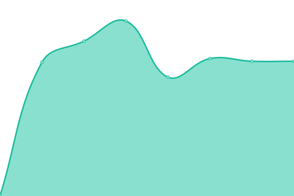

# [📈 Live Status](https://weirdyang.github.io/upptime-demo-repo): <!--live status--> **🟧 Partial outage**

This repository contains the open-source uptime monitor and status page for [weirdyang](https://weirdyang.github.io/upptime-demo-repo), powered by [Upptime](https://github.com/upptime/upptime).

With [Upptime](https://upptime.js.org), you can get your own unlimited and free uptime monitor and status page, powered entirely by a GitHub repository. We use [Issues](https://github.com/weirdyang/upptime-demo-repo/issues) as incident reports, [Actions](https://github.com/weirdyang/upptime-demo-repo/actions) as uptime monitors, and [Pages](https://weirdyang.github.io/upptime-demo-repo) for the status page.

<!--start: status pages-->
<!-- This summary is generated by Upptime (https://github.com/upptime/upptime) -->
<!-- Do not edit this manually, your changes will be overwritten -->
<!-- prettier-ignore -->
| URL | Status | History | Response Time | Uptime |
| --- | ------ | ------- | ------------- | ------ |
|  [DEV 5000](http://arcstonesolution.com:5000) | 🟩 Up | [dev-5000.yml](https://github.com/weirdyang/upptime-demo-repo/commits/HEAD/history/dev-5000.yml) | 

 579ms
     
 | 

<a href="https://weirdyang.github.io/upptime-demo-repo/history/dev-5000">97.01%</a>
    

|  [SANDBOX](https://sandbox.arcstonesolution.com) | 🟥 Down | [sandbox.yml](https://github.com/weirdyang/upptime-demo-repo/commits/HEAD/history/sandbox.yml) | 

 0ms
     
 | 

<a href="https://weirdyang.github.io/upptime-demo-repo/history/sandbox">0.00%</a>
    

|  [TESTING 11000](http://arcstonesolution.com:11000) | 🟩 Up | [testing-11000.yml](https://github.com/weirdyang/upptime-demo-repo/commits/HEAD/history/testing-11000.yml) | 

 537ms
     
 | 

<a href="https://weirdyang.github.io/upptime-demo-repo/history/testing-11000">98.83%</a>
    

<!--end: status pages-->

[**Visit our status website →**](https://weirdyang.github.io/upptime-demo-repo)

## 📄 License

- Powered by: [Upptime](https://github.com/upptime/upptime)
- Code: [MIT](./LICENSE) © [Anand Chowdhary](https://anandchowdhary.com), supported by [Pabio](https://pabio.com)
- Data in the `./history` directory: [Open Database License](https://opendatacommons.org/licenses/odbl/1-0/)
